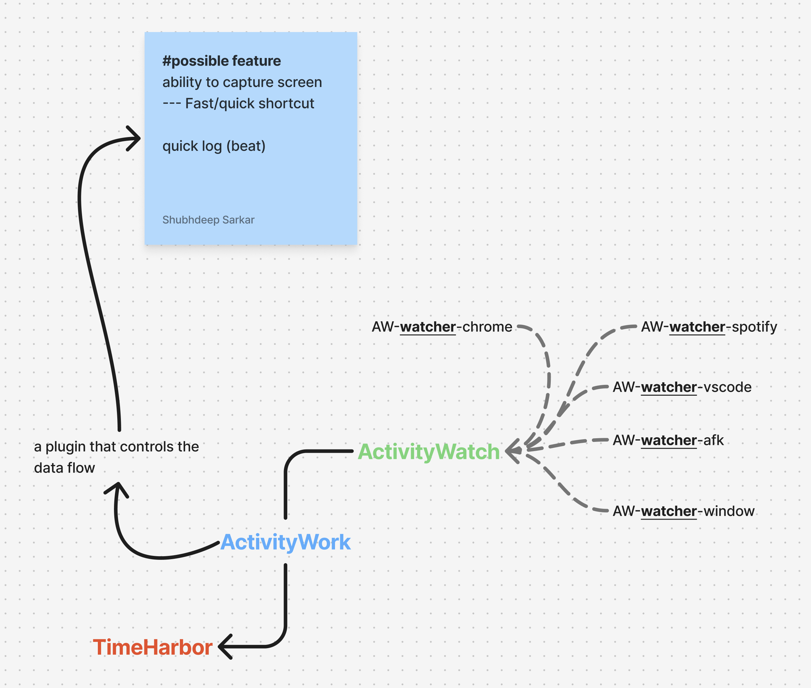

# ActivityWork App

Local-first MVP application that ingests ActivityWatch data and prepares it for downstream processing.


## Tech Stack

- Next.js 16 (App Router, Route Handlers)
- React 19 + TypeScript
- Tailwind CSS 4
- Prisma ORM
- SQLite (local development database)
- ESLint

## Current Features

- Landing page at `/` for plugin status and quick validation.
- Live preview API at `/api/aw/preview`.
- ActivityWatch client utilities in `lib/activitywatch-client.ts`.
- Browser console tracking via `app/preview-console.tsx`:
    - Polls every 5 seconds
    - Logs `ActivityWatch live update:` when newer events are detected
- Watcher discovery in preview response (`buckets`) so you can inspect available sources.

## ActivityWatch Preview Behavior

The preview endpoint prefers watcher buckets in this order when a specific bucket is not provided:

1. `aw-watcher-window`
2. `aw-watcher-web`
3. `aw-watcher-vscode`
4. `aw-watcher-afk`
5. first available bucket

You can also force a bucket manually:

```bash
curl "http://localhost:3000/api/aw/preview?bucketId=<bucket-id>&limit=50"
```

## Local Development

```bash
npm install
npm run dev
```

Open [http://localhost:3000](http://localhost:3000).

## Quality Checks

```bash
npm run lint
npm run build
```
